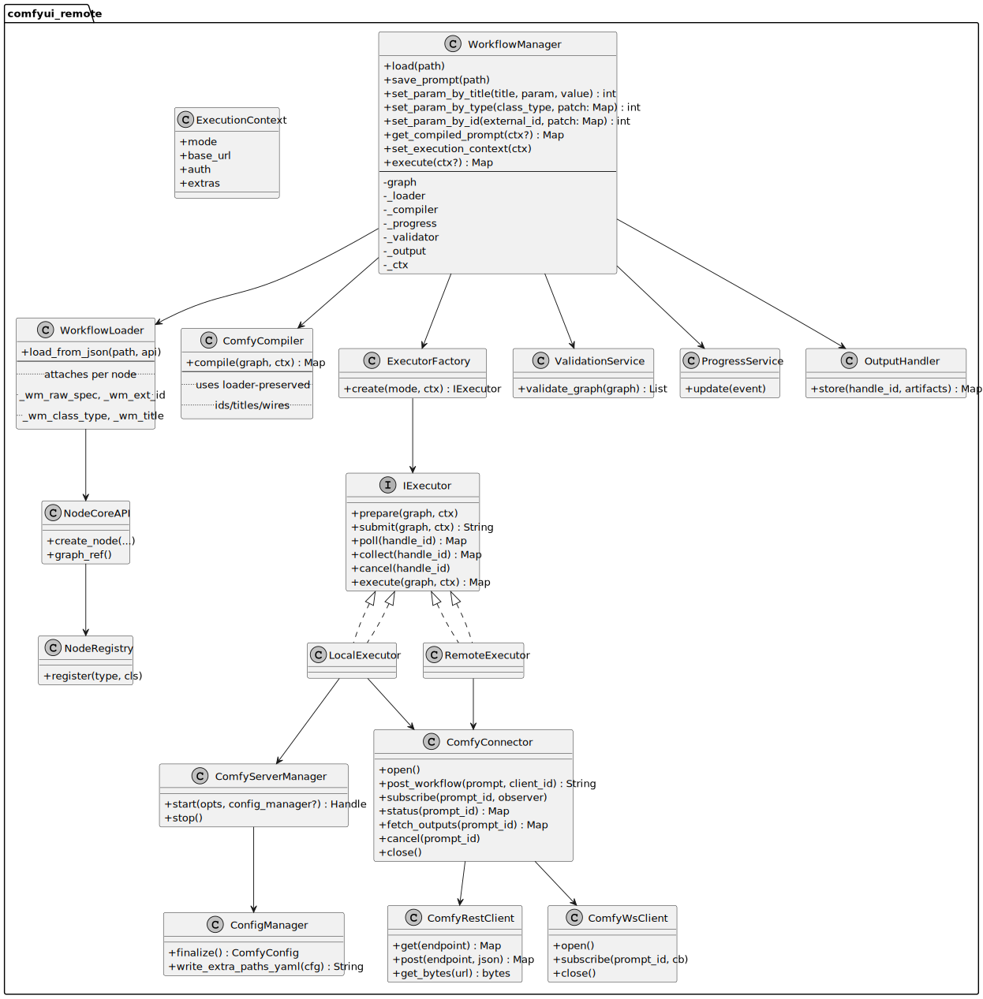
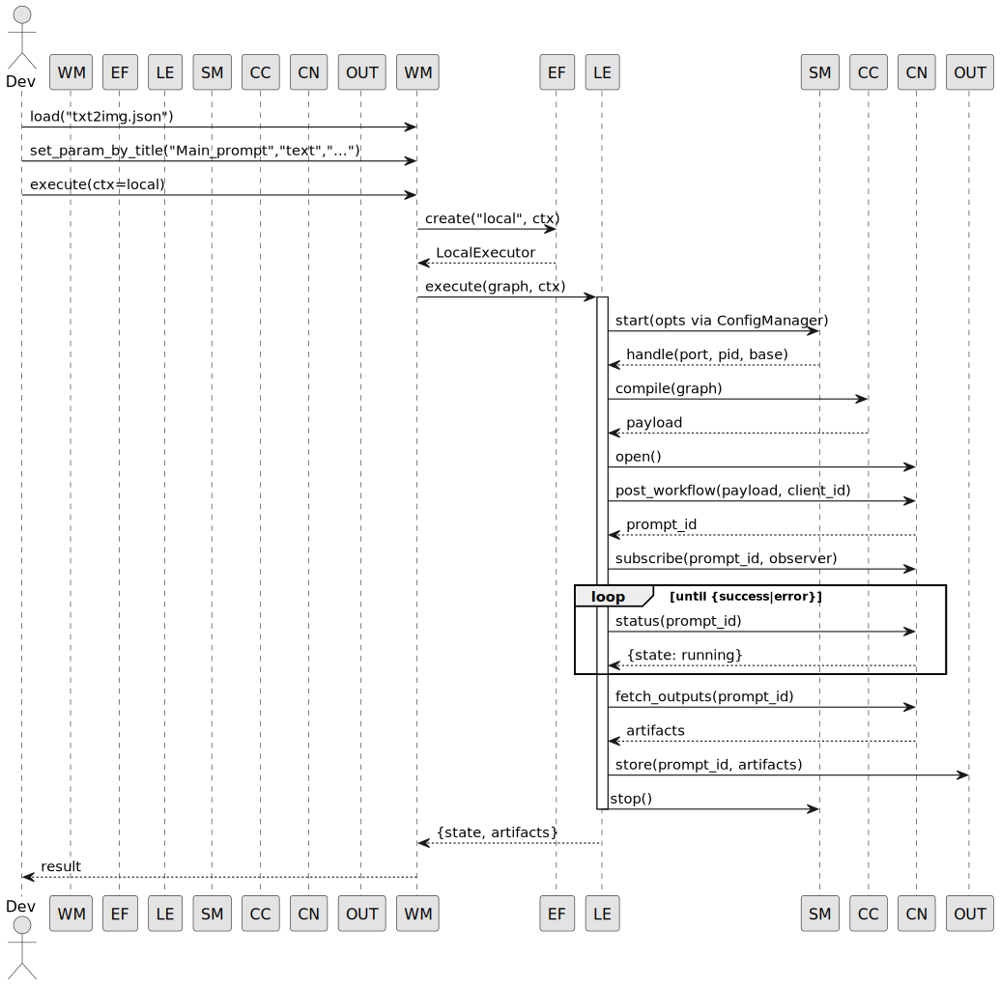
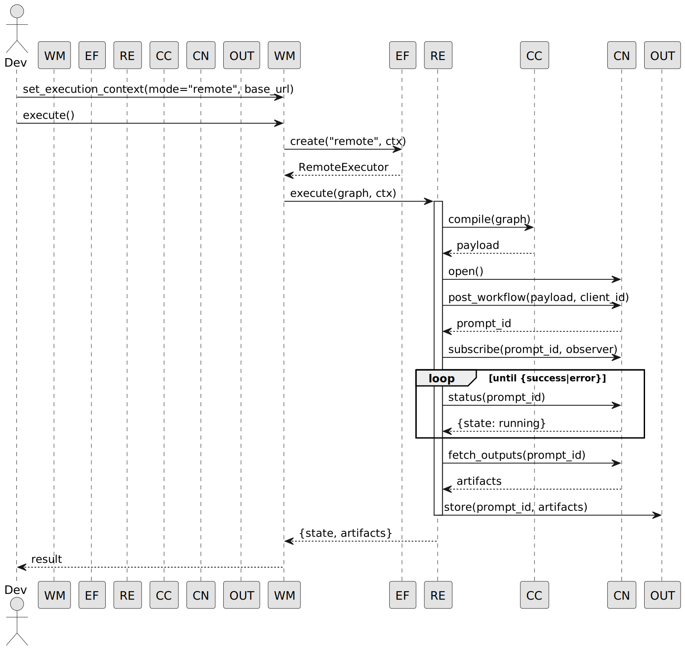
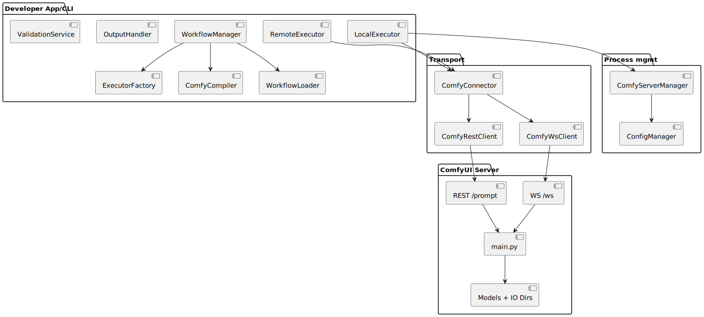

Awesome—here’s a clean, copy‑pasteable **CLI README** plus **PlantUML (.puml) diagrams** that reflect the architecture and flow you now have (loader‑aware compiler, workflow‑centric manager, executors, connector, server manager, YAML config).

---

## `README.cli.md` — ComfyUI Remote Toolkit (CLI)

> Command‑line entry points to **load**, **patch**, **validate**, and **run** Comfy editor workflows against a **local** or **remote** ComfyUI server. Designed to be deterministic, loader‑aware, and test‑friendly.

### Contents

* [Overview](#overview)
* [Requirements](#requirements)
* [Environment](#environment)
* [Configuration (YAML)](#configuration-yaml)
* [Commands](#commands)

  * [`validate`](#validate)
  * [`run`](#run)
* [Parameter overrides](#parameter-overrides)
* [Examples](#examples)
* [Exit codes](#exit-codes)
* [Logs & troubleshooting](#logs--troubleshooting)
* [Developer notes](#developer-notes)

---

### Overview

The CLI wraps the same internals used in tests and demos:

* **WorkflowLoader** parses editor JSON and preserves node IDs, titles, and wires.
* **ComfyCompiler** converts the in‑memory graph to a valid `/prompt` payload.
* **WorkflowManager** is the orchestration façade (load → patch → execute).
* **Executors** run **locally** (spawning ComfyUI) or **remotely** (reuse an existing server).

---

### Requirements

* Python 3.12+
* A ComfyUI installation:

  * Set **`COMFYUI_HOME`** to the folder containing `main.py`.
    (On Windows Electron, that’s typically
    `C:\Users\<you>\AppData\Local\Programs\@comfyorgcomfyui-electron\resources\ComfyUI`.)
* Models in a configured path (see *Configuration*).

---

### Environment

| Variable       | Purpose                                                                        |
| -------------- | ------------------------------------------------------------------------------ |
| `COMFYUI_HOME` | **Required**. Path to folder that contains `main.py`.                          |
| `COMFY_CONFIG` | Optional path to YAML config with model paths & server defaults.               |
| `COMFY_DEBUG`  | If set, the CLI will print the compiled `/prompt` payload for troubleshooting. |

> You can also load a `.env` at project root to populate these environment variables early.

---

### Configuration (YAML)

Create a YAML file (e.g. `configs/base.windows.yaml`) and point `COMFY_CONFIG` at it.

```yaml
home: "C:/Users/you/AppData/Local/Programs/@comfyorgcomfyui-electron/resources/ComfyUI"

server:
  host: "127.0.0.1"
  port: 0                   # 0 = choose a free port
  disable_cuda_malloc: false
  dont_print_server: false
  extra_args: []

io:
  input_dir:  ""
  output_dir: ""
  user_dir:   ""
  temp_dir:   ""

models:
  # Single root: subfolders will be auto-discovered if present
  root: "E:/comfyui/comfyui/models"

  # Fine-grained overrides (take precedence over root autodiscovery)
  checkpoints:     []
  vae:             []
  clip:            []
  clip_vision:     []
  diffusion_models:[]
  unet:            []
  loras:           []
  embeddings:      []
  controlnet:      []
  upscale_models:  []
  configs:         []
  custom_nodes:    ["E:/comfyui/comfyui/custom_nodes"]

env: {}                     # Extra env vars for the spawned process (Local mode)
```

The tool writes a **temporary `extra_model_paths.yaml`** that ComfyUI loads on startup, based on this config.

---

### Commands

You can run the CLI:

* If you’ve registered a console entrypoint: `comfy …`
* Or directly via module: `python -m comfyui_remote.cli.main …`

#### `validate`

**Purpose**: quick structural/semantic checks on a workflow file using the same loader as runtime.

```
comfy validate --workflow PATH/TO/your_workflow.json
```

**Flags**

| Flag / Arg         | Description                        |
| ------------------ | ---------------------------------- |
| `-w`, `--workflow` | Path to an editor JSON. (Required) |

**Behavior**

* Loads using the robust `WorkflowLoader`
* Runs `ValidationService` (non‑fatal, informational)
* Returns **0** on success; **1** if validation fails or load errors.

---

#### `run`

**Purpose**: load → (optionally patch) → compile → execute the workflow.

```
comfy run --workflow PATH/TO/workflow.json \
          [--params PATH/TO/overrides.(yaml|json)] \
          [--mode local|remote] \
          [--url http://127.0.0.1:64876] \
          [--token TOKEN] \
          [--verbose]
```

**Flags**

| Flag / Arg         | Description                                                               |
| ------------------ | ------------------------------------------------------------------------- |
| `-w`, `--workflow` | Path to editor JSON. (Required)                                           |
| `-p`, `--params`   | Path to YAML/JSON param overrides (see below). Optional.                  |
| `--mode`           | `local` (default) spawns ComfyUI; `remote` posts to an existing server.   |
| `--url`            | Base URL (required for `--mode remote`).                                  |
| `--token`          | Optional auth token if your server enforces auth.                         |
| `--verbose`        | Extra logs; in particular the compiled payload when `COMFY_DEBUG` is set. |

**Behavior**

* In **local** mode, it will start a server using `ComfyServerManager` and your YAML config; I/O dirs can come from config or env.
* In **remote** mode, it will use `--url` and **not** spawn a server.
* The CLI is a **launcher**—by default it returns **0** even if the server run ends in `"error"` state (so you can inspect artifacts/logs). If the CLI itself fails (e.g., bad flags, network error), it returns **1**.

---

### Parameter overrides

The CLI accepts a very small YAML/JSON file with flat keys to patch primitive node parameters **by name** across the graph (e.g., `steps`, `cfg`, `seed`, a `CLIPTextEncode.text`, etc.).
For fine‑grained changes, prefer programmatic patching by **title** / **type** / **id** in Python (see `WorkflowManager` APIs). The CLI’s `--params` is meant for simple, broad tweaks.

```yaml
# overrides.yaml
steps: 20
cfg: 7.5
seed: 123456
```

Then:

```
comfy run -w txt2img.json -p overrides.yaml --mode remote --url http://127.0.0.1:64876
```

---

### Examples

**Validate a workflow**

```
python -m comfyui_remote.cli.main validate -w tests/resources/workflows/txt2img.json
```

**Run locally** (spawns its own server using `COMFY_CONFIG`)

```
python -m comfyui_remote.cli.main run \
  -w tests/resources/workflows/txt2img.json \
  --mode local \
  --verbose
```

**Run against an existing server**

```
python -m comfyui_remote.cli.main run \
  -w tests/resources/workflows/txt2img.json \
  --mode remote --url http://127.0.0.1:64876 \
  -p overrides.yaml \
  --verbose
```

---

### Exit codes

| Code | Meaning                                                                                 |
| ---- | --------------------------------------------------------------------------------------- |
| `0`  | CLI completed. Run may still have `"state": "error"`; check logs/artifacts for details. |
| `1`  | CLI/runtime error (bad arguments, network failure, loader/compiler exception, etc.).    |

---

### Logs & troubleshooting

* **Server logs (local mode)**:
  `%TEMP%/comfyui-remote/comfy-<port>.log`
* **Payload dump**: set `COMFY_DEBUG` or pass `--verbose` to print the compiled prompt.
* **Common issues**

  * `value_not_in_list ckpt_name`: your checkpoint file isn’t found—fix `models.*` paths in YAML.
  * `Invalid image file`: source must be under server `input_dir`.
  * `Saving image outside the output folder`: ensure `SaveImage.filename_prefix` is not a path and `output_dir` is set.

---

### Developer notes

This CLI delegates to:

* `WorkflowManager.load()` → `WorkflowLoader`
* `WorkflowManager.get_compiled_prompt()` → `ComfyCompiler`
* `ExecutorFactory` → `LocalExecutor` / `RemoteExecutor`
* `ComfyConnector` handles REST/WS

See **UML** below for details.

### 1) Class diagram — core

**`uml/class-diagram.puml`**



### 2) Sequence — **local** run

**`uml/sequence-local.puml`**



### 3) Sequence — **remote** run

**`uml/sequence-remote.puml`**



### 4) Component — high level

**`uml/component.puml`**


