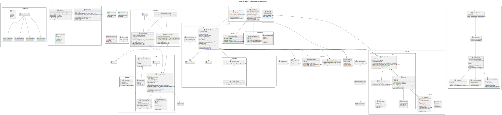

# comfyui-remote

A client toolkit to **load**, **parameterize**, and **execute** ComfyUI workflows locally or remotely.

## Overview

**comfyui-remote** provides a clean interface for automating ComfyUI workflows:

- Run **locally** (auto-start a ComfyUI server)
- Run against a **remote** ComfyUI instance
- Dispatch to a **render farm** via plugins (extensible architecture)

## Features

- **Clean CLI** for automation and scripting
- **Qt UI** (MVVM) for browsing and running workflows
- **Stable API layer** for embedding in other applications
- **Validation**, **logging**, and **progress events**
- **Extensible architecture** for custom executors and nodes

## Installation

```bash
pip install comfyui-remote
```

## Quick Start

### CLI Usage

```bash
# Local execution (auto-starts server if needed)
comfy run --workflow path/to/workflow.json --mode local

# Remote execution with authentication
comfy run --workflow path/to/workflow.json --mode remote --url http://host:8188 --token $TOKEN

# Parameter overrides
comfy run -w workflow.json -p Steps=50 Seed=12345 PositivePrompt="a castle"

# Validate workflow
comfy validate -w workflow.json

# List available templates
comfy templates list

# Show template details
comfy templates show txt2img

# Launch GUI
comfy gui
```

### Python API

```python
from comfyui_remote.api import WorkflowAPI, ExecutionAPI
from comfyui_remote.core import ExecutionContext

# Load workflow
workflow_api = WorkflowAPI()
workflow_api.load("workflow.json")

# Set parameters
workflow_api.set_params({
    "Steps": 50,
    "Seed": 12345,
    "PositivePrompt": "a castle"
})

# Execute
execution_api = ExecutionAPI()
ctx = ExecutionContext(mode="local")
result = execution_api.run(ctx)
```

## Architecture


### Core Components

#### 1. **Core Layer** (contracts & types)
- `IExecutor`: Interface for workflow execution
- `IConnector`: Interface for ComfyUI communication
- `ExecutionContext`: Execution configuration

#### 2. **Nodes & Graph**
- `NodeBase`, `NodeMetadata`: Node abstraction with typed metadata
- `Graph`: Nodes + connections representation
- `NodeRegistry`/`NodeFactory`: Registry and factory for node types

#### 3. **Workflows**
- `TemplateRepository`: Manage workflow templates
- `WorkflowLoader`: Import JSON/templates into graph
- `ComfyCompiler`: Convert Graph → ComfyUI prompt JSON

#### 4. **Execution**
- `ExecutorFactory`: Select appropriate executor (local/remote)
- `LocalExecutor`: Manages local ComfyUI server
- `RemoteExecutor`: Connects to existing ComfyUI instance

#### 5. **Connectors**
- `ComfyServerManager`: Start/stop local ComfyUI
- `ComfyRestClient`: HTTP communication
- `ComfyWsClient`: WebSocket for progress streaming
- `ComfyConnector`: Coordinates REST+WS communication

#### 6. **Services**
- `ValidationService`: Graph validation
- `ProgressService`: Progress event distribution
- `OutputHandler`: Artifact management
- `ConfigManager`: Configuration handling
- `LoggingService`: Centralized logging

### Project Structure

```
src/comfyui_remote/
├── core/               # Interfaces, exceptions, types
├── nodes/              # NodeBase, Graph, NodeCoreAPI
├── workflows/          # Templates, loader, compiler
├── executors/          # Local, remote, factory
├── connectors/         # ComfyUI server integration
├── services/           # Config, logging, progress, validation
├── handlers/           # Output handling
├── api/                # High-level facades
├── cli/                # Command-line interface
├── ui/qt/              # Qt GUI (MVVM)
└── utils/              # Helper utilities
```

## Execution Flow

### Local Workflow Execution

1. Load workflow (JSON/template) → build `Graph`
2. Compile graph → ComfyUI prompt payload
3. Start local ComfyUI server (if needed)
4. Submit workflow with unique `client_id`
5. Stream progress via WebSocket
6. Collect outputs via REST API
7. Store artifacts and cleanup

### Remote Workflow Execution

Same as local, but uses existing ComfyUI instance at specified URL.

## Configuration

### Environment variables

- `COMFYUI_HOME` — **required** for steps that start a real server.  
  Points to the folder that contains `main.py`.

  Examples:
  - Windows (Electron):  
    `C:\Users\<you>\AppData\Local\Programs\@comfyorgcomfyui-electron\resources\ComfyUI`

Optional:
- `COMFY_PORT` — fixed port; otherwise a free ephemeral port is chosen.
- `COMFY_LISTEN` — host address; default `127.0.0.1`.


### Execution Context

Configure execution via `ExecutionContext`:
- `mode`: "local" or "remote"
- `base_url`: ComfyUI server URL (for remote mode)
- `auth.token`: Authentication token

## Extensibility

### Custom Nodes

Register custom node types:

```python
from comfyui_remote.nodes import NodeRegistry, NodeBase

class CustomNode(NodeBase):
    # Implementation
    pass

registry = NodeRegistry()
registry.register("CustomNode", CustomNode)
```

### Custom Executors

Implement `IExecutor` for custom execution strategies:

```python
from comfyui_remote.core import IExecutor

class FarmExecutor(IExecutor):
    def prepare(self, graph, ctx):
        # Setup farm job
        pass
    
    def submit(self, graph, ctx):
        # Submit to farm
        return job_id
    
    # ... other methods
```

### Custom Compilers

Replace the default compiler:

```python
from comfyui_remote.workflows import IGraphCompiler

class CustomCompiler(IGraphCompiler):
    def compile(self, graph, ctx):
        # Custom compilation logic
        return prompt_json
```

## Error Handling

The module provides specific exception types:

- `ValidationError`: Invalid graph or parameters
- `ServerNotReady`: Local server startup failure
- `SubmissionError`: Workflow submission failure
- `ConnectorError`: Communication errors

## UI Architecture (MVVM)

The Qt UI follows Model-View-ViewModel pattern:

- **Views**: `MainWindow` and UI components
- **ViewModels**: `WorkflowViewModel`, `ParametersModel`, `RunsModel`
- **Controllers**: `RunController` connects UI and business logic
- **Theme**: Centralized theme management via QSS

## Design Principles

1. **Separation of Concerns**: Clear boundaries between orchestration, server control, and communication
2. **No Side Effects**: Explicit initialization, no hidden state changes
3. **Interface-First**: Clean abstractions enable substitution
4. **Observable Progress**: Central event system for UI/CLI updates
5. **Minimal Dependencies**: Only essential packages required

## Development

### Testing

```bash
pytest tests/
```

### Building

```bash
python -m build
```

### Contributing

1. Fork the repository
2. Create a feature branch
3. Make your changes
4. Add tests
5. Submit a pull request

## Future Enhancements

- Schema-driven parameter forms via `/object_info`
- Robust WebSocket reconnection with backoff
- Pluggable authentication (API keys, OAuth, proxies)
- Farm executor plugins via namespace packages
- Rich progress UI with per-node status and ETA

## License


## Support

For issues and questions:
- GitHub Issues: https://github.com/cmyoussef/comfyui-remote.git
- Documentation: [docs-url is coming]