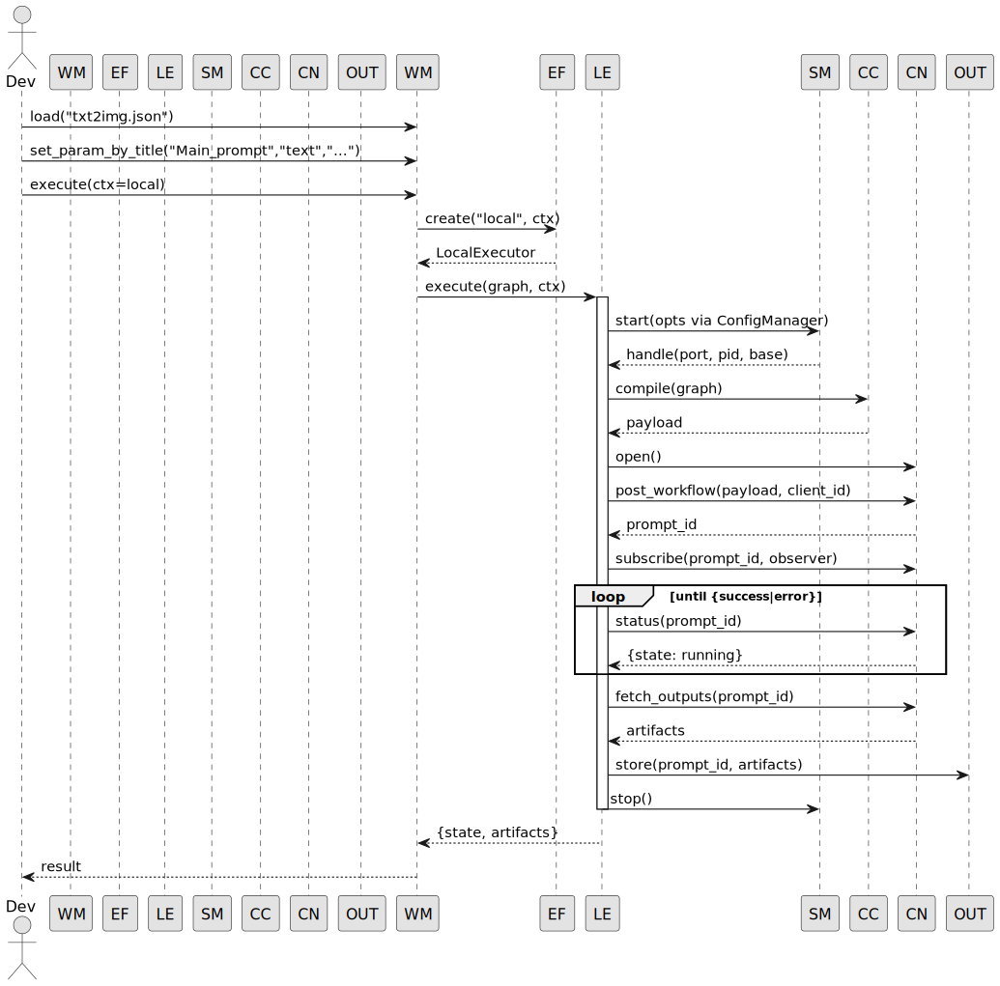
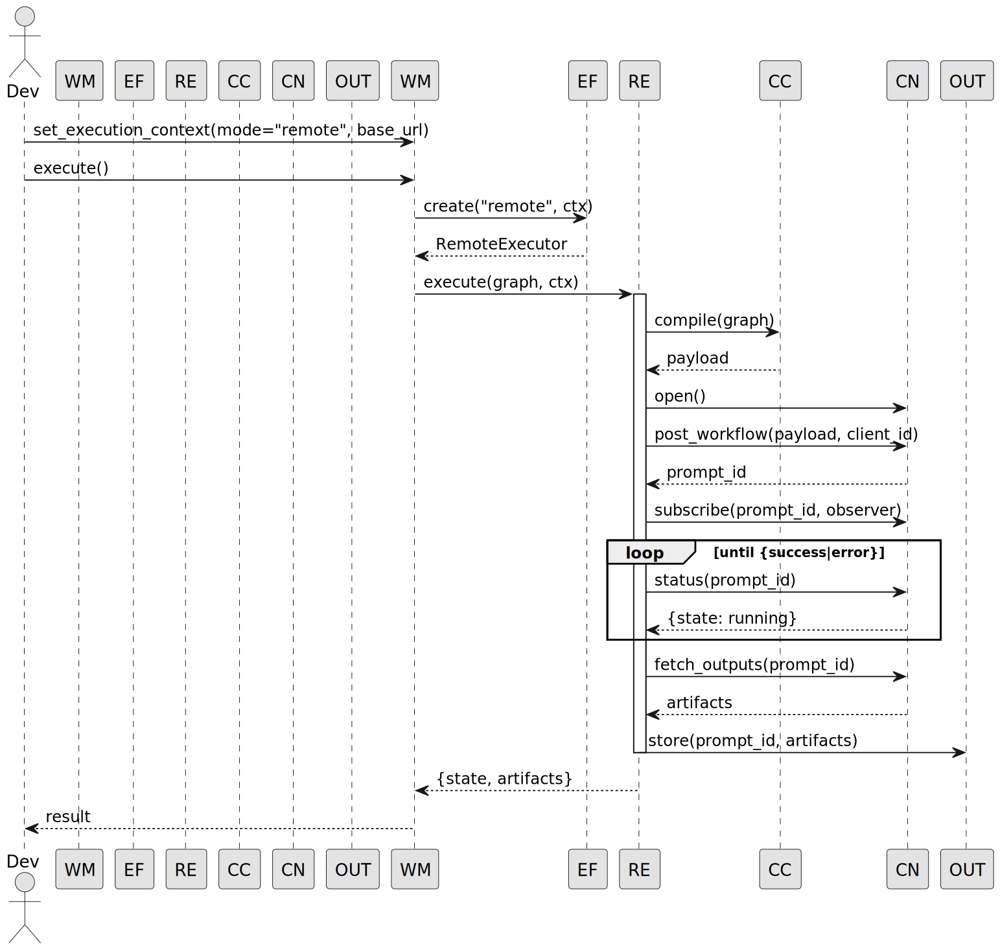

---

# ComfyUI Remote Toolkit — Developer Guide

> A small, testable layer that lets you **load** Comfy editor workflows, **patch** them programmatically, **compile** them to `/prompt` payloads, and **execute** them against a local or remote ComfyUI server with clean logging and artifacts.

---

## Table of Contents

* [Core ideas](#core-ideas)
* [Repository layout](#repository-layout)
* [Prerequisites](#prerequisites)
* [Configuration](#configuration)

  * [Environment variables](#environment-variables)
  * [Base config (YAML)](#base-config-yaml)
  * [Model folder discovery](#model-folder-discovery)
* [Quick start](#quick-start)

  * [Run all **step** tests](#run-all-step-tests)
  * [Run all **unit** tests](#run-all-unit-tests)
  * [E2E demos](#e2e-demos)
* [Developer workflow](#developer-workflow)

  * [Load a workflow](#load-a-workflow)
  * [Patch parameters (by title / by type / by id)](#patch-parameters-by-title--by-type--by-id)
  * [Compile and inspect the payload](#compile-and-inspect-the-payload)
  * [Execute (local vs remote)](#execute-local-vs-remote)
  * [Fetch outputs](#fetch-outputs)
* [Architecture overview](#architecture-overview)

  * [Modules & responsibilities](#modules--responsibilities)
  * [Execution flow (sequence)](#execution-flow-sequence)
* [Logging & troubleshooting](#logging--troubleshooting)
* [Extending the system](#extending-the-system)
* [UML diagrams](#uml-diagrams)

---

## Core ideas

* **Loader-aware compilation**: The `WorkflowLoader` ingests editor JSON and attaches preserved metadata to each node (`_wm_raw_spec`, `_wm_ext_id`, `_wm_class_type`, `_wm_title`). The `ComfyCompiler` uses those to emit a stable, compliant `/prompt` payload.
* **Workflow-centric API**: The `WorkflowManager` is your one object for: load → patch → save → execute → collect.
* **Environment + YAML config**: `ConfigManager` merges sane defaults with `COMFY_CONFIG` (YAML) and env vars, and `ComfyServerManager` launches ComfyUI with correct model paths and IO dirs.
* **Symmetric local/remote execution**: `ExecutorFactory` returns `LocalExecutor` (starts ComfyUI itself) or `RemoteExecutor` (uses an existing base URL). Both use the same `ComfyConnector` (REST + WS) contract.

---

## Repository layout

```
src/
  comfyui_remote/
    config/
      manager.py          # merges env + YAML + defaults; writes extra-model-paths YAML
      types.py            # strongly-typed config dataclasses
    connectors/
      comfy/
        server_manager.py # launches/stops ComfyUI using ConfigManager
        connector.py      # REST + WS plumbing
        rest_client.py
        ws_client.py
      session.py
    core/
      base/
        executor.py       # ExecutorBase + concrete IExecutor interface
        connector.py      # IConnector
        workflow.py       # ExecutionContext, etc.
      types.py
    executors/
      executor_factory.py # returns LocalExecutor or RemoteExecutor
      local/local_executor.py
      remote/remote_executor.py
    handlers/
      output/output_handler.py
    nodes/
      base/node_base.py
      core/node_core_api.py
      core/node_registry.py
    services/
      validation_service.py
      progress_service.py
      config_manager.py    # legacy; new config lives in comfyui_remote/config/*
    workflows/
      loader/workflow_loader.py
      manager/workflow_manager.py
      compiler/comfy_compiler.py

tests/
  resources/workflows/*.json
  steps/*.py              # integration tests that hit a live ComfyUI
  unit/*.py               # isolated tests
  e2e/                    # runnable demos
```

---

## Prerequisites

* **Python**: 3.12+
* **ComfyUI**: Either a source checkout or the Windows Electron build
  Set `COMFYUI_HOME` to the folder containing `main.py`.
* **Models**: At least one SD checkpoint (e.g. `v1-5-pruned-emaonly-fp16.safetensors`) in a path listed under `models.checkpoints` in your config.

---

## Configuration

### Environment variables

* `COMFYUI_HOME` (required): path to the directory containing `main.py`

  * Example (Windows Electron):
    `C:\Users\<you>\AppData\Local\Programs\@comfyorgcomfyui-electron\resources\ComfyUI`
* `COMFY_CONFIG` (optional): path to your YAML config (see below)
* `COMFY_DEBUG` (optional): set to any value to dump compiled payloads to stdout

### Base config (YAML)

We keep config in **YAML** because ComfyUI’s `extra_model_paths.yaml` is YAML.
Put this in `configs/base.windows.yaml` and set `COMFY_CONFIG` to that file:

```yaml
home: "C:/Users/you/AppData/Local/Programs/@comfyorgcomfyui-electron/resources/ComfyUI"

server:
  host: "127.0.0.1"
  port: 0             # 0 -> find free port automatically
  disable_cuda_malloc: false
  dont_print_server: false
  extra_args: []      # pass through if you need Comfy flags

io:
  input_dir:  ""      # can be overridden by tests / demo
  output_dir: ""
  user_dir:   ""
  temp_dir:   ""

models:
  # EITHER point to a single root folder (autodetect folders inside) ...
  root: "E:/comfyui/comfyui/models"

  # ... OR specify specific lists per family (overrides `root` for that key):
  checkpoints:     []
  vae:             []
  clip:            []
  clip_vision:     []
  diffusion_models:[]
  unet:            []
  loras:           []
  embeddings:      []
  controlnet:      []
  upscale_models:  []
  configs:         []
  custom_nodes:    ["E:/comfyui/comfyui/custom_nodes"]

env: {}               # additional env vars for the ComfyUI process
```

### Model folder discovery

If you set `models.root`, the config layer will expand any **known subfolders** that exist under that root (e.g., `checkpoints`, `vae`, `clip`, `loras`, …). You can still override any one category explicitly by listing it—explicit lists take precedence over the root auto‑discovery.

---

## Quick start

### Run all **step** tests

From repo root:

```bash
pytest -q tests/steps
```

(These spawn ComfyUI; make sure `COMFYUI_HOME` is set and you have a valid config.)

### Run all **unit** tests

```bash
pytest -q tests/unit
```

(These use fakes and do not require a ComfyUI instance.)

### E2E demos

**Manager‑centric remote run** (server starts & stops within the script):

```bash
python tests/e2e/run_demo_manager_remote_workflow_centric.py
```

What it does:

1. Starts ComfyUI (`ComfyServerManager`) with clean I/O dirs.
2. Creates a `WorkflowManager`, loads `txt2img.json`.
3. Patches the text prompt by **node title** (`"Main_prompt"`).
4. Compiles the payload with `ComfyCompiler`.
5. Executes in **remote** mode against the server it just started.
6. Prints state and artifact info; saves the compiled prompt for inspection.

---

## Developer workflow

### Load a workflow

```python
from comfyui_remote.workflows.manager.workflow_manager import WorkflowManager

wm = WorkflowManager()  # default services inside
wm.load("tests/resources/workflows/txt2img.json")  # editor JSON
```

The loader preserves the editor information on each node:

* `_wm_raw_spec` — canonical `{class_type, inputs, _meta:{title}}`
* `_wm_ext_id` — the original editor id (e.g., "6")
* `_wm_class_type` — e.g. `CLIPTextEncode`
* `_wm_title` — human name if present

### Patch parameters (by title / by type / by id)

* **By title** (human‑friendly, resilient):

```python
wm.set_param_by_title("Main_prompt", "text",
    "A photoreal glass bottle in an ocean, pyramids inside, cinematic lighting")
```

* **By type**:

```python
wm.set_param_by_type("KSampler", {"seed": 42, "steps": 25})
```

* **By external id** (exact editor id):

```python
wm.set_param_by_id("6", {"text": "New prompt"})
```

> These methods only update **primitive** parameters; connection wires stay intact as loaded.

### Compile and inspect the payload

```python
payload = wm.get_compiled_prompt()
wm.save_prompt(".comfy_outputs/prompt.json")
```

The compiler:

* Preserves original node keys (editor ids) when available.
* Sanitizes `SaveImage.filename_prefix`.
* Normalizes connections (`["6","IMAGE"] → ["6", 0]`).
* Coerces common scalar types (`seed`:int, `cfg`:float, etc.).

### Execute (local vs remote)

**Remote** (you already have a server):

```python
from comfyui_remote.core.base.workflow import ExecutionContext

wm.set_execution_context(ExecutionContext(mode="remote", base_url="http://127.0.0.1:64876"))
result = wm.execute()
print(result["state"], result["artifacts"])
```

**Local** (Toolkit will start ComfyUI):

```python
wm.set_execution_context(ExecutionContext(mode="local"))
result = wm.execute()
```

Under the hood:

* `ExecutorFactory` returns `LocalExecutor` or `RemoteExecutor`.
* `LocalExecutor` spawns a server via `ComfyServerManager`, then posts/monitors the prompt.
* Both executors use `ComfyConnector` (REST + WebSocket).

### Fetch outputs

If artifacts contain view URLs, you can fetch bytes via `ComfyRestClient` or use the files saved under the configured ComfyUI `output_dir`.

---

## Architecture overview

### Modules & responsibilities

* **ConfigManager** (`config/manager.py`)

  * Loads YAML (via `COMFY_CONFIG`), merges env + defaults.
  * Performs model root auto-discovery.
  * Writes a **temporary** `extra_model_paths.yaml` for ComfyUI.

* **ComfyServerManager** (`connectors/comfy/server_manager.py`)

  * Launches/stops a ComfyUI process, wiring the IO dirs and the extra model paths YAML.
  * Health-checks `/object_info` before returning.

* **NodeRegistry / NodeCoreAPI** (`nodes/core`)

  * Minimal graph API used by loader/manager to create nodes and edges.

* **WorkflowLoader** (`workflows/loader/workflow_loader.py`)

  * Parses editor JSON, normalizes to internal nodes, attaches `_wm_*` attributes, and builds a fast **title/id/type index** for later lookups.

* **ComfyCompiler** (`workflows/compiler/comfy_compiler.py`)

  * Converts the in‑memory graph into a compliant `/prompt` payload.
  * Preserves editor ids and titles; sanitizes and normalizes inputs.

* **ComfyConnector** (`connectors/comfy/connector.py`)

  * Thin facade over REST (`rest_client.py`) + WS (`ws_client.py`).
  * `post_workflow`, `subscribe`, `status`, `fetch_outputs`, `cancel`.

* **Executors** (`executors/*`)

  * `LocalExecutor`: start server → compile → submit → wait → collect → stop.
  * `RemoteExecutor`: compile → submit (no spawning) → wait → collect.

* **WorkflowManager** (`workflows/manager/workflow_manager.py`)

  * End‑user API: `load`, `set_param_by_*`, `save_prompt`, `execute`.
  * Internally uses `ExecutorFactory`, `ValidationService`, `ProgressService`, `OutputHandler`.

* **Services**

  * `ValidationService`: syntax/sanity checks on the graph.
  * `ProgressService`: WS progress notifications fan‑out.
  * `OutputHandler`: saves run manifests, normalizes artifact metadata.

### Execution flow (sequence)

**Local run**

1. `WorkflowManager.execute(ctx=local)`
2. `ExecutorFactory.create("local")` → `LocalExecutor`
3. `LocalExecutor.prepare()` → `ComfyServerManager.start()`
4. `ComfyCompiler.compile(graph)` → payload
5. `ComfyConnector.open()` → `post_workflow(payload, client_id)`
6. `ComfyConnector.subscribe()` WS events → `ProgressService`
7. Poll `status()` until `success/error` → `fetch_outputs()`
8. `OutputHandler.store()` → manifest
9. `ComfyServerManager.stop()`

**Remote run** is identical, minus step 3.

---

## Logging & troubleshooting

* Set `--verbose` on the CLI or `COMFY_DEBUG=1` to dump payloads.
* Server logs are written under `%TEMP%/comfyui-remote/comfy-<port>.log`.
* Common issues:

  * **`prompt_outputs_failed_validation` / `value_not_in_list ckpt_name`**
    Your model folders were not visible to ComfyUI. Fix `models.root` or specific `models.checkpoints` entries; confirm the exact filename exists.
  * **`Invalid image file`** on `LoadImage`
    Make sure the file is inside the configured `input_dir` (server side).
  * **`Saving image outside the output folder`**
    We sanitize `filename_prefix`, but ensure you don’t pass paths in prefix and that `output_dir` is correctly set when launching the server.
  * **Server doesn’t start / `TypeError` in extra paths**
    Use YAML config (not JSON), and let `ConfigManager` render a proper `extra_model_paths.yaml`. Do **not** pass a list where Comfy expects a scalar or a `|` multi-line block.

---

## Extending the system

* **New executors**: implement `IExecutor` (`submit/poll/collect/cancel/execute`) and register in `ExecutorFactory`.
* **Alternate connectors**: implement `IConnector` if you need a different transport/protocol.
* **Custom nodes**: Loader preserves everything the editor JSON provides; your node can expose richer params via `NodeBase.params()` which the compiler will overlay.

---

## UML diagrams

> You can paste these into any Mermaid‑enabled viewer (e.g., GitHub, VS Code Mermaid).

### 1) Class diagram — core

**`uml/class-diagram.puml`**


### 2) Sequence — **local** run

**`uml/sequence-local.puml`**



### 3) Sequence — **remote** run

**`uml/sequence-remote.puml`**



### 4) Component — high level

**`uml/component.puml`**


